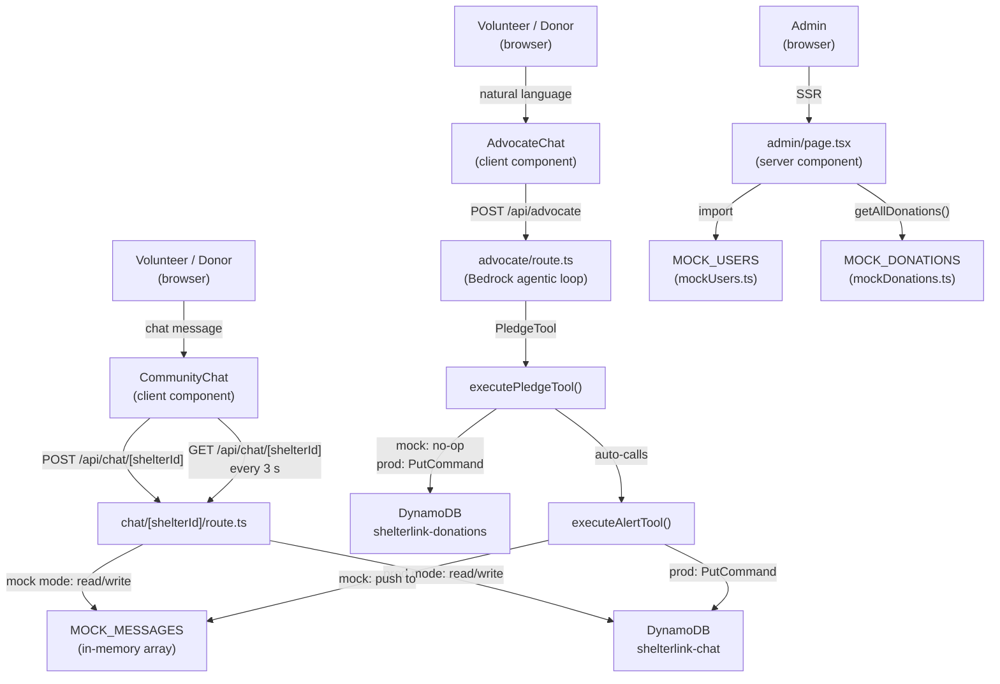

# Design Document — Community Activity Feed

## Overview

The Community Activity Feed feature adds four cohesive improvements to ShelterLink:

1. **Pledge notifications** — the Advocate agent auto-posts a formatted `ChatMessage` to the shelter's community chat whenever `PledgeTool` fires, so the Activity_Feed reflects real donation activity without any manual action.
2. **Mock community members** — `mockUsers.ts` holds 8 realistic `MockUser` profiles linked to `mockDonations.ts` records, giving the platform a lived-in feel in mock mode.
3. **Admin community members view** — the `/admin` page gains a "Community Members" table that surfaces each user's role, activity summary, and linked donation records.
4. **Admin UI token consistency** — all raw Tailwind color classes in `admin/page.tsx` and `admin/layout.tsx` are replaced with the project's design token system so dark mode works correctly.

The feature is entirely additive — no existing API contracts or data schemas change.

---

## Architecture



### Key architectural decisions

- **In-memory mock store**: `MOCK_MESSAGES` lives as a module-level mutable array in `chat/[shelterId]/route.ts`. `executeAlertTool` in `advocate/route.ts` calls the same `POST /api/chat/[shelterId]` path in production, but in mock mode it pushes directly to `MOCK_MESSAGES` via the shared module reference. This keeps the pledge → chat notification path identical in both modes.
- **No new API routes**: pledge notifications flow through the existing `executeAlertTool` helper; the admin community members view reads `MOCK_USERS` directly at SSR time — no new endpoints needed.
- **Polling retained**: the tech stack rules note AppSync subscriptions as the long-term target, but the existing 3-second `setInterval` in `CommunityChat` is sufficient for this feature and is already implemented.

---

## Components and Interfaces

### `CommunityChat` (existing — visual changes only)

File: `packages/dashboard/src/components/CommunityChat.tsx`

The `isAdvocateMessage` helper already exists. The rendering branch for advocate messages needs the teal styling applied consistently:

```
isAdvocateMessage(msg) === true
  → li: bg-teal-50 dark:bg-teal-900/10, -mx-4 px-4 py-1.5 rounded
  → senderName span: text-teal-700 dark:text-teal-300
  → message p: text-teal-800 dark:text-teal-200 font-medium
  → NO UserType badge rendered

isAdvocateMessage(msg) === false
  → default surface styling
  → UserType badge rendered using USER_TYPE_COLORS[msg.userType]
```

The `isAdvocateMessage` predicate:
```typescript
function isAdvocateMessage(msg: ChatMessage): boolean {
  return msg.userType === 'ADMIN' && msg.senderName === 'Community Advocate';
}
```

### `executeAlertTool` (existing — mock path change)

File: `packages/dashboard/src/app/api/advocate/route.ts`

In mock mode, `executeAlertTool` currently returns early without writing to `MOCK_MESSAGES`. It must instead push a `ChatMessage` to the shared `MOCK_MESSAGES` array so polling clients see the notification immediately.

The auto-call from `executePledgeTool` already exists:
```typescript
await executeAlertTool({
  shelterId: pledgeShelterId,
  message: `🤝 ${donor} has pledged to donate ${qty}× ${pledgeItem}`,
});
```

The mock branch of `executeAlertTool` must be updated to:
```typescript
if (USE_MOCK) {
  // Import and push to MOCK_MESSAGES in chat route
  const { MOCK_MESSAGES } = await import('@/app/api/chat/[shelterId]/route');
  MOCK_MESSAGES.push({
    roomId: shelterId,
    timestamp: new Date(timestamp).toISOString(),
    senderName: 'Community Advocate',
    message,
    userType: 'ADMIN',
  });
  return JSON.stringify({ shelterId, message, status: 'posted', timestamp, mock: true });
}
```

> Note: Because both route files run in the same Next.js server process, the module-level `MOCK_MESSAGES` array is shared. The dynamic import is used to avoid circular dependency issues at module load time. An alternative is to extract `MOCK_MESSAGES` to a separate `lib/mockChat.ts` module imported by both routes — this is the preferred approach for clarity.

### `admin/page.tsx` (existing — new section + token cleanup)

The Community Members section is already scaffolded. Required changes:
- Ensure all raw color classes are replaced with design tokens (audit pass)
- Confirm the empty-state branch renders when `MOCK_USERS.length === 0`
- Confirm donation sub-rows are rendered for users with `donationIds.length > 0`

### `mockUsers.ts` / `mockDonations.ts` (existing — data integrity)

These files are already populated with 8 matching users and donations. The design requires:
- Every `DonationRecord.userId` in `MOCK_DONATIONS` has a matching `MockUser.userId` in `MOCK_USERS`
- Every `donationId` in `MockUser.donationIds` exists in `MOCK_DONATIONS`
- At least one user of each type: `VOLUNTEER`, `DONOR`, `STAFF`

---

## Data Models

### `ChatMessage` (existing, no changes)

```typescript
interface ChatMessage {
  roomId: string;       // shelter ID, e.g. "shelter-001"
  timestamp: string;    // ISO 8601
  senderName: string;   // "Community Advocate" for pledge notifications
  message: string;      // "🤝 Alice Johnson has pledged to donate 10× blankets"
  userType: UserType;   // "ADMIN" for pledge notifications
}
```

Pledge notification invariants:
- `senderName === "Community Advocate"`
- `userType === "ADMIN"`
- `message` matches `/^🤝 .+ has pledged to donate \d+× .+$/`
- `donorName` defaults to `"Anonymous"` when absent
- `quantity` defaults to `1` when absent

### `MockUser` (existing, no changes)

```typescript
interface MockUser {
  userId: string;          // "user-alice" — matches DonationRecord.userId
  name: string;            // "Alice Johnson"
  email: string;           // "alice@example.com"
  userType: 'VOLUNTEER' | 'DONOR' | 'STAFF';
  joinedAt: string;        // ISO 8601
  activitySummary: string; // human-readable summary of linked donations
  donationIds: string[];   // ["donation-001"] — each must exist in MOCK_DONATIONS
}
```

### `DonationRecord` (existing, no changes)

```typescript
interface DonationRecord {
  userId: string;       // must match a MockUser.userId
  donationId: string;   // must appear in the matching MockUser.donationIds
  shelterId: string;
  shelterName: string;
  donorName: string;
  donorEmail: string;
  items: DonationItem[];
  status: 'PLEDGED' | 'IN_TRANSIT' | 'DELIVERED';
  pledgedAt: string;
  deliveredAt?: string;
}
```

### Referential integrity between `MockUser` and `DonationRecord`

```
MockUser.userId  ←→  DonationRecord.userId   (1:many)
MockUser.donationIds[n]  →  DonationRecord.donationId  (must exist)
```

---

## Correctness Properties

*A property is a characteristic or behavior that should hold true across all valid executions of a system — essentially, a formal statement about what the system should do. Properties serve as the bridge between human-readable specifications and machine-verifiable correctness guarantees.*

### Property 1: Pledge notification format

*For any* combination of `donorName` (including empty/absent), `quantity` (including absent), `item`, and `shelterId` passed to `executePledgeTool`, the resulting `ChatMessage` pushed to `MOCK_MESSAGES` should have `senderName === "Community Advocate"`, `userType === "ADMIN"`, `roomId === shelterId`, and `message` matching the pattern `🤝 <name> has pledged to donate <qty>× <item>` where `<name>` is `"Anonymous"` when `donorName` is absent/empty and `<qty>` is `1` when `quantity` is absent.

**Validates: Requirements 1.1, 1.2, 1.3, 1.6**

### Property 2: Pledge notification written to mock store

*For any* valid pledge input in mock mode, after `executePledgeTool` completes, a `GET /api/chat/[shelterId]` response should contain exactly one new message with `senderName === "Community Advocate"` and `userType === "ADMIN"` compared to the state before the pledge.

**Validates: Requirements 1.6, 1.5**

### Property 3: Advocate message rendering

*For any* `ChatMessage` where `isAdvocateMessage` returns `true`, the rendered `<li>` element should contain the teal background class, the sender name should be rendered in teal text, the message body should be rendered in teal text with `font-medium`, and no `UserType` badge element should be present.

**Validates: Requirements 2.1, 2.2, 2.3, 2.4**

### Property 4: Non-advocate message badge rendering

*For any* `ChatMessage` where `isAdvocateMessage` returns `false`, the rendered output should contain a badge element whose CSS classes match `USER_TYPE_COLORS[msg.userType]`.

**Validates: Requirements 2.5**

### Property 5: Mock data referential integrity

*For any* `DonationRecord` in `MOCK_DONATIONS`, there exists a `MockUser` in `MOCK_USERS` with a matching `userId` and that user's `donationIds` array contains the `donationId`. Conversely, *for any* `donationId` in any `MockUser.donationIds`, there exists a `DonationRecord` in `MOCK_DONATIONS` with that `donationId`.

**Validates: Requirements 3.3, 3.4**

### Property 6: Member row rendering completeness

*For any* `MockUser`, the rendered admin table row should contain the user's full name, email, a badge element with the correct color class for their `userType` (`VOLUNTEER`→green, `DONOR`→blue, `STAFF`→purple), the `activitySummary` text, and a formatted `joinedAt` date string.

**Validates: Requirements 4.2, 4.3**

### Property 7: Chat endpoint shelter filtering

*For any* `shelterId`, a `GET /api/chat/[shelterId]` response in mock mode should return only messages where `roomId === shelterId` — no messages from other shelter rooms should appear.

**Validates: Requirements 6.5**

### Property 8: POST endpoint rejects empty message

*For any* request body where `message` is absent, an empty string, or a string of only whitespace, `POST /api/chat/[shelterId]` should return HTTP 400 with body `{ "error": "Missing message" }`.

**Validates: Requirements 7.5**

### Property 9: POST endpoint coerces invalid userType

*For any* `userType` value that is not `"VOLUNTEER"`, `"DONOR"`, or `"STAFF"`, the message stored by `POST /api/chat/[shelterId]` should have `userType === "VOLUNTEER"`.

**Validates: Requirements 7.6**

---

## Error Handling

| Scenario | Behavior |
|---|---|
| `executeAlertTool` throws during auto-post after `PledgeTool` | Caught in a `try/catch` inside `executePledgeTool`; pledge result is still returned successfully. The error is non-fatal. |
| Polling `GET /api/chat/[shelterId]` fails | `CommunityChat` catches the error silently and retries on the next 3-second interval. No error UI is shown. |
| `POST /api/chat/[shelterId]` receives missing/empty `message` | Returns HTTP 400 `{ error: "Missing message" }`. |
| `POST /api/chat/[shelterId]` receives invalid `userType` | Coerced to `"VOLUNTEER"` — no error returned. |
| `MOCK_USERS` is empty at admin page render time | Admin page renders "No community members yet" empty state in the Community Members section. |
| Dynamic import of `MOCK_MESSAGES` fails in mock mode | `executeAlertTool` logs the error and returns a mock success response — pledge is unaffected. |

---

## Testing Strategy

### Dual approach

Both unit tests and property-based tests are required. Unit tests cover specific examples, edge cases, and integration points. Property tests verify universal correctness across generated inputs.

### Property-based testing

The project uses `fast-check` (already a dependency in `packages/lambda`; add to `packages/dashboard` dev dependencies). Each property test runs a minimum of 100 iterations.

Each test is tagged with a comment referencing the design property:
```
// Feature: community-activity-feed, Property N: <property text>
```

**Property test file**: `packages/dashboard/src/app/api/chat/[shelterId]/route.pbt.test.ts`

| Property | Test description | `fast-check` arbitraries |
|---|---|---|
| P1 | Pledge notification format | `fc.record({ donorName: fc.option(fc.string()), quantity: fc.option(fc.nat()), item: fc.string({ minLength: 1 }), shelterId: fc.string({ minLength: 1 }) })` |
| P2 | Pledge written to mock store | Same as P1; assert GET response delta |
| P7 | Chat endpoint shelter filtering | `fc.string({ minLength: 1 })` for shelterId |
| P8 | POST rejects empty message | `fc.oneof(fc.constant(''), fc.constant(undefined), fc.stringOf(fc.constant(' ')))` |
| P9 | POST coerces invalid userType | `fc.string().filter(s => !['VOLUNTEER','DONOR','STAFF'].includes(s))` |

**Property test file**: `packages/dashboard/src/components/CommunityChat.pbt.test.tsx`

| Property | Test description | `fast-check` arbitraries |
|---|---|---|
| P3 | Advocate message rendering | `fc.record({ senderName: fc.constant('Community Advocate'), userType: fc.constant('ADMIN'), message: fc.string(), roomId: fc.string(), timestamp: fc.date().map(d => d.toISOString()) })` |
| P4 | Non-advocate badge rendering | `fc.record({ userType: fc.constantFrom('VOLUNTEER','DONOR','STAFF'), senderName: fc.string().filter(s => s !== 'Community Advocate'), ... })` |

**Property test file**: `packages/dashboard/src/lib/mockData.pbt.test.ts`

| Property | Test description |
|---|---|
| P5 | Mock data referential integrity — iterate all records, assert cross-references |
| P6 | Member row rendering — `fc.constantFrom(...MOCK_USERS)` |

### Unit tests

**`CommunityChat.test.tsx`** — example-based:
- Renders initial messages correctly
- Polling calls fetch every 3 s (fake timers)
- Polling cleanup on unmount
- Silent error handling on poll failure
- Auto-scroll on new messages
- Send button disabled + "Sending…" during POST
- Anonymous fallback when senderName is blank
- Immediate GET after successful POST

**`route.test.ts` (chat endpoint)** — example-based:
- GET returns only messages for the requested shelterId
- POST 400 on missing message
- POST 400 on empty message
- POST coerces unknown userType to VOLUNTEER
- POST stores message in MOCK_MESSAGES

**`advocate.test.ts`** — example-based:
- Pledge notification failure does not fail the pledge (mock `executeAlertTool` to throw)
- Pledge notification uses "Anonymous" when donorName absent
- Pledge notification defaults quantity to 1

**`admin/page.test.tsx`** — example-based:
- Renders all MOCK_USERS rows
- Shows member count subtitle
- Renders empty state when MOCK_USERS is empty
- Each row contains name, email, role badge, activitySummary, joinedAt

### Test configuration

```typescript
// vitest.config.ts (packages/dashboard) — already configured
// Add fast-check:
// npm install --save-dev fast-check  (in packages/dashboard)
```

Minimum iterations per property test:
```typescript
fc.assert(fc.property(...), { numRuns: 100 });
```
