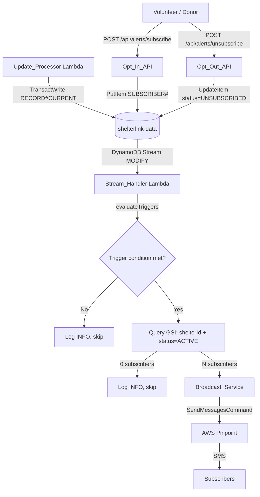

# Design Document — SMS Broadcast Alerts

## Overview

SMS Broadcast Alerts adds outbound SMS notifications to ShelterLink. When a shelter reaches a critical state — transitioning to FULL or CLOSED, recovering to OPEN, or gaining a new CRITICAL-priority supply need — AWS Pinpoint sends SMS messages to all subscribed volunteers and donors for that shelter.

The feature closes the loop on the existing inbound-only SMS path. Pinpoint is already wired in CDK (CfnApp + CfnSMSChannel + IAM + SSM params live), and `handler.ts` already has a working `sendSms()` helper. This design adds three new pieces on top of that foundation:

1. **Subscription management** — opt-in/opt-out API routes + a GSI on `shelterlink-data`
2. **Broadcast trigger logic** — alert condition evaluation inside the existing Stream_Handler
3. **Broadcast_Service module** — fan-out to ACTIVE subscribers via Pinpoint

No new DynamoDB tables. No new Lambda functions. No new event sources.

---

## Architecture

```
Shelter Manager (SMS / Web Form)
  → Lambda Function URL (Update_Processor)
  → DynamoDB shelterlink-data (RECORD#CURRENT)
  → DynamoDB Stream → Stream_Handler Lambda
      ├── evaluateTriggers(newImage, oldImage) → AlertTrigger | null
      ├── queryActiveSubscribers(shelterId, GSI) → SubscriberRecord[]
      └── broadcastAlerts(trigger, subscribers) → Pinpoint SendMessagesCommand

Volunteer / Donor (Browser)
  → POST /api/alerts/subscribe   → Opt_In_API  → shelterlink-data SUBSCRIBER# items
  → POST /api/alerts/unsubscribe → Opt_Out_API → shelterlink-data SUBSCRIBER# items (status=UNSUBSCRIBED)

Inbound STOP/START SMS
  → Lambda Function URL (Update_Processor)
  → processKeyword(STOP|START) → UpdateItem on SUBSCRIBER# items
```

### Mermaid — Broadcast Fan-Out Flow



---

## Components and Interfaces

### 1. Subscription Data Store (GSI on `shelterlink-data`)

A new GSI is added to the existing `shelterlink-data` table to support efficient fan-out queries.

**GSI: `subscribers-by-shelter`**
- Partition key: `shelterId` (String)
- Sort key: `status` (String)
- Projection: ALL

This allows the Stream_Handler to query `shelterId = "shelter-001" AND status = "ACTIVE"` in a single paginated Query call without scanning the full table.

**Item shape:**

```typescript
interface SubscriptionItem {
  PK: `SUBSCRIBER#${string}`;   // SHA-256 hash of phone
  SK: `SHELTER#${string}`;      // shelterId
  phone: string;                 // raw E.164 — used by Pinpoint for delivery
  shelterId: string;             // GSI partition key
  status: 'ACTIVE' | 'UNSUBSCRIBED';  // GSI sort key
  subscribedAt: string;          // ISO 8601
  updatedAt: string;             // ISO 8601
  // NO ttl attribute — subscriptions persist until explicitly unsubscribed
}
```

### 2. Opt_In_API — `POST /api/alerts/subscribe`

Next.js API route at `packages/dashboard/src/app/api/alerts/subscribe/route.ts`.

**Request:**
```typescript
{ phone: string; shelterId: string }
```

**Response (success):**
```typescript
{ ok: true }   // HTTP 200
```

**Response (error):**
```typescript
{ ok: false; error: string }   // HTTP 400 (invalid phone) | HTTP 500
```

**Processing:**
1. Validate `phone` against E.164 regex: `/^\+[1-9]\d{1,14}$/`
2. Validate `shelterId` is non-empty
3. Hash phone with SHA-256 (reuse `hashPhone()` pattern from `registry.ts`)
4. `PutItem` with `ConditionExpression: "attribute_not_exists(PK)"` — returns 200 if item already exists (condition failure is swallowed)
5. Call `sendSms(phone, confirmationMessage)` via Pinpoint
6. Log structured INFO: `{ shelterId, maskedPhone }`

### 3. Opt_Out_API — `POST /api/alerts/unsubscribe`

Next.js API route at `packages/dashboard/src/app/api/alerts/unsubscribe/route.ts`.

**Request:**
```typescript
{ phone: string }
```

**Response:** HTTP 200 always (even if no records found).

**Processing:**
1. Validate `phone` against E.164 regex
2. Hash phone
3. Query `PK = SUBSCRIBER#<hash>` to get all shelter subscriptions for this phone
4. Batch `UpdateItem` each record: `SET status = UNSUBSCRIBED, updatedAt = <now>`
5. Log structured INFO: `{ maskedPhone, count }`

### 4. Broadcast_Service (`packages/lambda/src/broadcastService.ts`)

Pure module — no module-level state. Accepts injected clients for testability.

```typescript
export type AlertTriggerType = 'STATUS_FULL' | 'STATUS_CLOSED' | 'STATUS_OPEN' | 'CRITICAL_NEED';

export interface AlertTrigger {
  type: AlertTriggerType;
  shelterId: string;
  shelterName: string;
  beds?: number;
  capacity?: number;
  newCriticalItems?: string[];
}

export interface SubscriberRecord {
  phone: string;   // raw E.164
  shelterId: string;
  status: 'ACTIVE' | 'UNSUBSCRIBED';
}

/**
 * Evaluates DynamoDB Streams NEW_IMAGE / OLD_IMAGE to determine if a broadcast
 * trigger condition is met. Returns null if no trigger applies.
 * No DynamoDB reads — pure function over the two image objects.
 */
export function evaluateTriggers(
  newImage: Record<string, unknown>,
  oldImage: Record<string, unknown> | null,
): AlertTrigger | null

/**
 * Formats an outbound SMS message for the given trigger.
 * Truncates shelter name if the message would exceed 160 characters.
 * Always ends with "Reply STOP to unsubscribe."
 */
export function formatAlertMessage(trigger: AlertTrigger): string

/**
 * Dispatches SMS to all provided subscribers via Pinpoint.
 * Logs WARN per failed delivery; never throws.
 * Skips silently if PINPOINT_APP_ID is absent or 'PENDING'.
 */
export async function broadcastAlerts(
  trigger: AlertTrigger,
  subscribers: SubscriberRecord[],
  pinpointClient: PinpointClient,
  logger: Logger,
): Promise<void>
```

### 5. Stream_Handler — Extended (`packages/lambda/src/streamHandler.ts`)

The existing handler is extended to call the Broadcast_Service after writing the SSE update payload.

**New processing steps (after existing PutCommand):**
1. Extract `oldImage` from `record.dynamodb.OldImage`
2. Call `evaluateTriggers(newImage, oldImage)` — pure, no I/O
3. If trigger is null → log INFO, continue
4. Query `subscribers-by-shelter` GSI: `shelterId = X AND status = ACTIVE`
5. If zero results → log INFO, continue
6. Call `broadcastAlerts(trigger, subscribers, pinpointClient, logger)`
7. On error → push to `batchItemFailures` (existing pattern)

### 6. STOP/START Keyword Handling (Update_Processor extension)

In `handler.ts`, `processUpdate()` is extended to detect STOP/START keywords before the registry lookup:

```typescript
const trimmedBody = smsBody.trim().toUpperCase();
if (trimmedBody === 'STOP') {
  await unsubscribePhone(senderPhone, dynamoClient, SHELTER_TABLE);
  await sendSms(senderPhone, 'You have been unsubscribed from ShelterLink alerts. Reply START to resubscribe.');
  return null;
}
if (trimmedBody === 'START') {
  await resubscribePhone(senderPhone, dynamoClient, SHELTER_TABLE);
  return null;
}
```

### 7. Dashboard Subscription Component

New React component `packages/dashboard/src/components/AlertSubscribeForm.tsx` rendered on `/shelter/[id]/page.tsx`.

**Props:**
```typescript
interface AlertSubscribeFormProps {
  shelterId: string;
}
```

**Behavior:**
- Phone input: accepts `+`, digits, spaces, dashes, parentheses
- Client-side normalization to E.164 before POST (strip non-digits, prepend `+1` if no country code)
- Calls `POST /api/alerts/subscribe` on submit
- Shows success/error state inline
- Unsubscribe link calls `POST /api/alerts/unsubscribe`

---

## Data Models

### New Types (`packages/lambda/src/types.ts` additions)

```typescript
export type SubscriptionStatus = 'ACTIVE' | 'UNSUBSCRIBED';

export type AlertTriggerType = 'STATUS_FULL' | 'STATUS_CLOSED' | 'STATUS_OPEN' | 'CRITICAL_NEED';

export interface SubscriptionRecord {
  PK: string;           // SUBSCRIBER#<hashedPhone>
  SK: string;           // SHELTER#<shelterId>
  phone: string;        // raw E.164
  shelterId: string;    // GSI PK
  status: SubscriptionStatus;  // GSI SK
  subscribedAt: string; // ISO 8601
  updatedAt: string;    // ISO 8601
}

export interface AlertTrigger {
  type: AlertTriggerType;
  shelterId: string;
  shelterName: string;
  beds?: number;
  capacity?: number;
  newCriticalItems?: string[];
}
```

### DynamoDB Access Patterns

| Operation | Key pattern | Index |
|---|---|---|
| Create subscription | `PK=SUBSCRIBER#<hash>`, `SK=SHELTER#<id>` | Main table |
| Unsubscribe (all shelters) | `PK=SUBSCRIBER#<hash>` | Main table (Query) |
| Fan-out: ACTIVE subscribers for shelter | `shelterId=<id>`, `status=ACTIVE` | `subscribers-by-shelter` GSI |
| STOP/START keyword | `PK=SUBSCRIBER#<hash>` | Main table (Query + BatchWrite) |

### CDK Changes (`packages/infra/lib/shelter-link-stack.ts`)

```typescript
// Add GSI to existing shelterlink-data table
table.addGlobalSecondaryIndex({
  indexName: 'subscribers-by-shelter',
  partitionKey: { name: 'shelterId', type: dynamodb.AttributeType.STRING },
  sortKey:      { name: 'status',    type: dynamodb.AttributeType.STRING },
  projectionType: dynamodb.ProjectionType.ALL,
});

// Grant stream handler Query access to GSI
lambdaRole.addToPolicy(new iam.PolicyStatement({
  actions: ['dynamodb:Query'],
  resources: [`${table.tableArn}/index/subscribers-by-shelter`],
}));
```

### Environment Variables

No new environment variables required. The Stream_Handler and Broadcast_Service reuse:
- `PINPOINT_APP_ID` — already injected via SSM
- `ORIGINATION_NUMBER` — already injected via SSM
- `SHELTER_TABLE` — already set on Update_Processor; add to Stream_Handler env
- `AWS_REGION` — standard Lambda env

The Stream_Handler CDK definition needs `SHELTER_TABLE` and `PINPOINT_APP_ID` / `ORIGINATION_NUMBER` added to its `environment` block.

---

## Correctness Properties

*A property is a characteristic or behavior that should hold true across all valid executions of a system — essentially, a formal statement about what the system should do. Properties serve as the bridge between human-readable specifications and machine-verifiable correctness guarantees.*

### Property 1: E.164 validation rejects all non-conforming inputs

*For any* string that does not match the E.164 pattern (`/^\+[1-9]\d{1,14}$/`), the Opt_In_API's phone validation function should return an error and the Subscription_Store should remain unchanged.

**Validates: Requirements 1.2, 1.3**

---

### Property 2: Subscription creation idempotence

*For any* valid E.164 phone number and shelter ID, calling the subscribe endpoint twice should result in exactly one subscription record in the Subscription_Store — the second call must not create a duplicate.

**Validates: Requirements 1.4**

---

### Property 3: Subscription record completeness

*For any* valid subscription creation, the stored DynamoDB item should have: `PK = SUBSCRIBER#<sha256(phone)>`, `SK = SHELTER#<shelterId>`, `status = ACTIVE`, a valid ISO 8601 `subscribedAt` timestamp, a valid ISO 8601 `updatedAt` timestamp, the raw E.164 `phone` attribute, and no `ttl` attribute.

**Validates: Requirements 1.5, 6.1, 6.2, 6.4, 6.5**

---

### Property 4: Unsubscribe sets all records to UNSUBSCRIBED

*For any* phone number with one or more ACTIVE subscription records, calling the unsubscribe endpoint should result in every subscription record for that phone number having `status = UNSUBSCRIBED`.

**Validates: Requirements 2.1**

---

### Property 5: STOP/START keyword case-insensitivity

*For any* casing of the string "stop" (e.g. `STOP`, `stop`, `Stop`, `sToP`), the Update_Processor should treat it as an opt-out and set all subscription records for that phone to `UNSUBSCRIBED`. Similarly, any casing of "start" should restore all records to `ACTIVE`.

**Validates: Requirements 2.2, 2.3**

---

### Property 6: UNSUBSCRIBED subscribers never receive broadcasts

*For any* broadcast event and any subscriber with `status = UNSUBSCRIBED`, the Broadcast_Service should not include that subscriber's phone number in any Pinpoint `SendMessagesCommand` call.

**Validates: Requirements 2.5**

---

### Property 7: Trigger condition correctness

*For any* pair of old and new shelter images from a DynamoDB Streams event, `evaluateTriggers` should return a non-null `AlertTrigger` if and only if at least one of the following is true: (a) new status is FULL and old status was not FULL, (b) new status is CLOSED and old status was not CLOSED, (c) new status is OPEN and old status was FULL or CLOSED, (d) the new needs list contains a CRITICAL item whose name was not present in the old needs list. For all other transitions, it should return null.

**Validates: Requirements 3.1, 3.2, 3.3, 3.4, 3.6**

---

### Property 8: Alert message format correctness

*For any* `AlertTrigger` value, `formatAlertMessage` should return a string that: (a) starts with `"ShelterLink Alert: "`, (b) ends with `"Reply STOP to unsubscribe."`, (c) contains the shelter name, (d) is 160 characters or fewer, and (e) still contains `"Reply STOP to unsubscribe."` even when the shelter name is truncated.

**Validates: Requirements 4.1, 4.2, 4.3, 4.4, 4.6, 4.7**

---

### Property 9: Multiple CRITICAL items produce a single SMS

*For any* shelter update that introduces N ≥ 2 new CRITICAL needs items, the Broadcast_Service should call Pinpoint's `SendMessagesCommand` exactly once per subscriber (not N times), with a message body that lists all new CRITICAL items.

**Validates: Requirements 4.5**

---

### Property 10: Partial delivery failure resilience

*For any* list of subscribers where a subset of Pinpoint delivery calls fail, the Broadcast_Service should: (a) not throw an unhandled exception, (b) continue attempting delivery to all remaining subscribers, and (c) log a WARN event for each failed delivery.

**Validates: Requirements 5.5, 5.6**

---

### Property 11: API responses never contain raw phone numbers

*For any* call to the Opt_In_API or Opt_Out_API, the HTTP response body should not contain the raw E.164 phone number that was submitted.

**Validates: Requirements 9.3**

---

### Property 12: Stream_Handler batch item failure reporting

*For any* batch of DynamoDB Streams records where processing one or more records throws an error, the Stream_Handler should return a `batchItemFailures` array containing exactly the sequence numbers of the failed records — not the successful ones.

**Validates: Requirements 7.4**

---

### Property 13: Client-side phone normalization

*For any* phone number string composed of digits, spaces, dashes, parentheses, and an optional leading `+`, the client-side normalization function should produce a valid E.164 string (matching `/^\+[1-9]\d{1,14}$/`).

**Validates: Requirements 8.6**

---

## Error Handling

### Opt_In_API

| Condition | HTTP Status | Response |
|---|---|---|
| Missing `phone` or `shelterId` | 400 | `{ ok: false, error: 'Missing required fields: phone, shelterId' }` |
| Invalid E.164 format | 400 | `{ ok: false, error: 'Invalid phone number format. Use E.164 (e.g. +12025551234)' }` |
| Subscription already exists | 200 | `{ ok: true }` (idempotent) |
| DynamoDB error | 500 | `{ ok: false, error: 'Internal server error' }` |
| Pinpoint confirmation SMS fails | 200 | `{ ok: true }` — subscription is created; SMS failure is logged WARN, not surfaced |

### Opt_Out_API

| Condition | HTTP Status | Response |
|---|---|---|
| Missing `phone` | 400 | `{ ok: false, error: 'Missing required field: phone' }` |
| Invalid E.164 format | 400 | `{ ok: false, error: 'Invalid phone number format' }` |
| No records found | 200 | `{ ok: true }` (no-op) |
| DynamoDB error | 500 | `{ ok: false, error: 'Internal server error' }` |

### Broadcast_Service

- `PINPOINT_APP_ID` absent or `PENDING` → log INFO `'Pinpoint disabled — skipping broadcast'`, return without error
- Individual `SendMessagesCommand` failure → log WARN with `{ shelterId, triggerType, maskedPhone }`, continue to next subscriber
- All subscribers fail → log WARN with `{ shelterId, triggerType, recipientCount: 0 }`, return without throwing
- GSI query pagination error → re-throw (Stream_Handler will add to `batchItemFailures`)

### Stream_Handler

- `evaluateTriggers` throws → log ERROR, add record to `batchItemFailures`
- GSI query returns zero results → log INFO `{ shelterId, triggerType: 'no_subscribers' }`, continue
- `broadcastAlerts` throws → log ERROR, add record to `batchItemFailures`
- Existing SSE `PutCommand` failure → re-throw (existing behavior preserved)

### Dashboard Component

- API returns 400 → display `error` field from response body
- API returns 500 → display generic "Something went wrong. Please try again."
- Network error → display "Unable to connect. Please check your connection."
- Never expose raw error stack traces or internal AWS error messages to the browser

---

## Testing Strategy

### Dual Testing Approach

Both unit tests and property-based tests are required and complementary:
- Unit tests catch concrete bugs with specific examples, integration points, and edge cases
- Property tests verify universal correctness across randomized inputs

### Property-Based Testing

Library: **`fast-check`** (already used in `packages/lambda` and `packages/dashboard`)

- Minimum **100 iterations** per property test
- Each property test references its design property via a comment tag:
  ```typescript
  // Feature: sms-broadcast-alerts, Property 7: Trigger condition correctness
  ```
- Each correctness property above maps to exactly one property-based test

**Key property test files:**

| File | Properties covered |
|---|---|
| `packages/lambda/src/broadcastService.pbt.test.ts` | P7, P8, P9, P10 |
| `packages/lambda/src/subscription.pbt.test.ts` | P1, P2, P3, P4, P5, P6 |
| `packages/lambda/src/streamHandler.pbt.test.ts` | P12 |
| `packages/dashboard/src/components/AlertSubscribeForm.pbt.test.tsx` | P13 |
| `packages/dashboard/src/app/api/alerts/subscribe/route.pbt.test.ts` | P11 |

**Generator notes:**
- E.164 generator: `fc.string({ minLength: 2, maxLength: 15 }).map(s => '+' + s.replace(/\D/g, ''))` — plus a separate invalid-phone generator for P1
- Shelter name generator: include long names (50+ chars) to exercise truncation in P8
- Trigger pair generator: `fc.record({ oldStatus, newStatus, oldNeeds, newNeeds })` covering all status combinations
- Subscriber list generator: mix of ACTIVE and UNSUBSCRIBED records for P6 and P10

### Unit Testing

Library: **Vitest** + `@testing-library/react` (dashboard), **Vitest** (lambda)

Unit tests focus on specific examples, integration points, and error conditions:

**Key unit test files:**

| File | Coverage |
|---|---|
| `packages/lambda/src/broadcastService.test.ts` | `formatAlertMessage` examples, Pinpoint PENDING skip, WARN log on failure |
| `packages/lambda/src/streamHandler.test.ts` | STOP/START keyword routing, non-RECORD#CURRENT skip, zero-subscriber skip |
| `packages/dashboard/src/app/api/alerts/subscribe/route.test.ts` | Happy path, duplicate idempotence, 400 on bad phone |
| `packages/dashboard/src/app/api/alerts/unsubscribe/route.test.ts` | Happy path, no-op on missing record, 400 on bad phone |
| `packages/dashboard/src/components/AlertSubscribeForm.test.tsx` | Form render, success state, error state, unsubscribe click |

### Running Tests

```bash
# Lambda property tests
cd packages/lambda && npm run test

# Dashboard tests
cd packages/dashboard && npm run test
```

Always use `vitest --run` (not watch mode) for CI.
