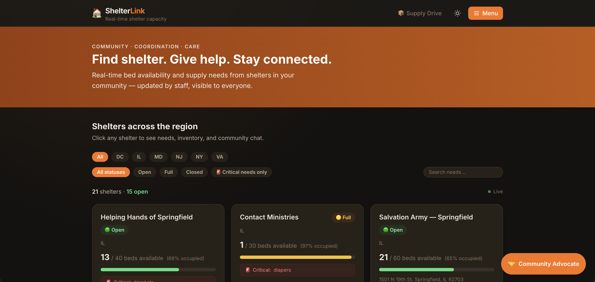

# ShelterLink

> Real-time shelter capacity tracking and community coordination — built for the AWS Reachback Hackathon.
> Theme: *Build for Impact — Code That Matters to Your Community*

---

## What It Does

ShelterLink lets non-technical shelter staff submit capacity updates via a web form or SMS simulator. Those updates appear instantly on a public-facing dashboard that any volunteer or donor can access — no account, no app, no friction. Community members can chat in real time per shelter, and donors can pledge supplies and track delivery.



**The critical path:**

```
Web Form / SMS Simulator
  → Lambda Function URL (Update_Processor)
  → DynamoDB shelterlink-data (RECORD#CURRENT + LOG#<ts>)
  → DynamoDB Stream → Stream Handler Lambda
  → SSE /api/updates → Next.js Dashboard
  → Volunteer / Donor (Browser)

Community Member (Browser)
  → POST /api/chat/[shelterId] → DynamoDB shelterlink-chat
  → AppSync Subscription onNewMessage → All connected clients

Volunteer / Donor (Browser)
  → POST /api/advocate → Amazon Bedrock (Nova Pro)
  → PledgeTool → shelterlink-donations
  → AlertTool  → shelterlink-chat + AppSync push
```

> **Pinpoint note:** AWS Pinpoint SMS requires sandbox approval on new accounts. Pinpoint resources are commented out in the CDK stack with `TODO` markers. The Lambda Function URL provides equivalent ingest capability for demo purposes. To re-enable: request SMS sandbox access in the AWS Console, then uncomment the Pinpoint block in `packages/infra/lib/shelter-link-stack.ts`.

---

## Quick Start

```bash
# Install dependencies
npm install

# Run the dashboard locally with mock data (no AWS needed)
cd packages/dashboard && npm run dev

# Run all tests
npm run test --workspaces
```

### Local dev with mock data

The dashboard defaults to mock data (real US shelters) when `USE_MOCK_DATA=true` is set in `packages/dashboard/.env.local`. No AWS credentials required.

```bash
# packages/dashboard/.env.local
AWS_REGION=us-east-1
USE_MOCK_DATA=true
```

---

## Environment Variables

Create `packages/dashboard/.env.local` before running locally:

```bash
# Local dev (mock data — no AWS needed)
AWS_REGION=us-east-1
USE_MOCK_DATA=true

# Production (real DynamoDB + AppSync)
AWS_REGION=us-east-1
SHELTER_TABLE=shelterlink-shelters
CHAT_TABLE=shelterlink-chat
DONATIONS_TABLE=shelterlink-donations
AWS_ACCESS_KEY_ID=
AWS_SECRET_ACCESS_KEY=
NEXT_PUBLIC_APPSYNC_ENDPOINT=
NEXT_PUBLIC_APPSYNC_API_KEY=

# Admin auth
NEXT_PUBLIC_ALLOWED_ORIGIN=https://your-domain.com
NEXTAUTH_SECRET=          # openssl rand -base64 32
NEXTAUTH_URL=https://your-domain.com
GITHUB_CLIENT_ID=
GITHUB_CLIENT_SECRET=
ALLOWED_EMAILS=           # comma-separated allowed GitHub emails

# AI Community Advocate
BEDROCK_REGION=us-east-1  # must have bedrock:InvokeModel and bedrock:Converse on amazon.nova-pro-v1:0
```

Lambda environment variables are set automatically by the CDK stack.

---

## New Features

| Feature | Description |
|---|---|
| Lambda Function URL | Public HTTPS endpoint for update ingestion — replaces Pinpoint for demo/hackathon |
| Real-Time Dashboard | SSE-powered shelter list updates within 5 seconds of any capacity change |
| Prioritized Needs List | Per-shelter needs ranked CRITICAL → HIGH → MEDIUM → LOW, filterable without page reload |
| Inventory Management | Shelter staff track current supply quantities via admin panel; atomic DynamoDB `UpdateItem` |
| Community Chat | Real-time per-shelter chat via AWS AppSync GraphQL subscriptions |
| Donation Tracking | Donors pledge supplies; admins mark pledges as delivered; full status history |
| AI Community Advocate | Bedrock-powered agentic assistant — matches donors to shelters, executes pledges and chat alerts via tools |
| Community Activity Feed | Pledge notifications auto-posted to shelter chat by the Advocate agent |
| Admin Panel | GitHub OAuth-gated registry management, inventory editing, and donation oversight |
| SMS Broadcast Alerts | Outbound SMS notifications via Pinpoint when shelters go FULL/CLOSED or gain CRITICAL needs — volunteers and donors subscribe per-shelter via the shelter detail page; STOP/START keyword opt-out/in supported via inbound SMS |
| Donation Form Needs Dropdown | Pledge form pre-populates a dropdown of the shelter's current unfulfilled needs (with priority labels); donors can also type a custom item. Deep-linkable via `?item=<item>` from the Supply Drive page. |
| Advocate Quick-Select Chips | On shelter detail pages, the AI Advocate chat panel shows color-coded chips for the shelter's active needs (red = CRITICAL, orange = HIGH). Clicking a chip pre-fills the input so donors don't have to type. |

---

## AI Community Advocate

ShelterLink includes an AI-powered Community Advocate built on Amazon Bedrock (Amazon Nova Pro). It's a conversational assistant embedded in the dashboard that helps volunteers and donors take immediate, high-impact action.

**What it does:**
- Matches your donation items to shelters with those items listed as CRITICAL or HIGH priority needs — using live DynamoDB data
- Summarizes what's happening at a specific shelter based on its current needs and inventory
- Guides new users through the Build for Impact mission and the ShelterLink workflow
- On shelter detail pages, shows color-coded quick-select chips for the shelter's active needs — click a chip to pre-fill the input instead of typing

**Tone:** Empathetic, grounded, and action-oriented. Every response ends with a specific next step. Responses render with full markdown formatting (bold, lists, etc.).

**Architecture:**
```
Browser (AdvocateChat component)
  → POST /api/advocate  { message, shelterId?, context, history[] }
  → Fetch live shelter data from DynamoDB (or mock store)
  → Build system prompt with shelter context
  → Bedrock ConverseCommand (agentic loop, max 3 iterations)
  → Tool execution: PledgeTool → DynamoDB, AlertTool → chat
  → Return { text: string, toolUsed?: string } → Browser
```

**Example interaction:**
> User: "I have winter coats — where should I go?"
>
> Advocate: "Winter coats are critically needed right now. Central Union Mission in DC has them listed as CRITICAL with 25 beds open — they're actively accepting donations today. Head to their shelter page to pledge your coats and check the community chat for drop-off timing."

**Setup:**
1. Set `BEDROCK_REGION=us-east-1` in `packages/dashboard/.env.local`
2. Attach an IAM policy to your user/role with `bedrock:InvokeModel`, `bedrock:InvokeModelWithResponseStream`, and `bedrock:Converse` on `"Resource": "*"`
3. Enable Amazon Nova Pro in the Bedrock console under Model access (no use case form required)

> **Model note:** Amazon Nova Pro (`amazon.nova-pro-v1:0`) requires no Anthropic use case approval and is available immediately in new AWS accounts. Claude models require submitting an Anthropic use case form before first use.

---

## Agentic AI — Reducing Time-to-Impact

### The Shift: From Search-Based UI to Action-Based AI

Traditional donation platforms require donors to navigate a multi-step funnel: browse shelters → find a match → open a form → fill it out → submit. Every step is friction. Every step loses people.

ShelterLink's Agentic AI Advocate collapses that funnel to a single natural language message.

> "Help me donate these coats" → pledge created, shelter notified, donor confirmed — in one turn.

This is the core 2026 Agentic AI pattern: **the model doesn't just answer questions, it takes actions**.

### How It Works

The Advocate uses the **Bedrock Converse API** with two callable tools:

| Tool | What it does | When the model uses it |
|---|---|---|
| `PledgeTool` | Writes a donation pledge to DynamoDB | User expresses donation intent |
| `AlertTool` | Posts a coordination message to shelter's Community Chat | User wants to notify staff or volunteers |

The agentic loop:
```
User message + conversation history (last 10 turns)
  → Bedrock ConverseCommand (with tool definitions, max 3 iterations)
  → Model decides: answer with text OR call a tool
  → If tool: API route executes it (DynamoDB write)
  → Tool result fed back to model as toolResult content block
  → Model generates confirmation message
  → Strip any <thinking> blocks from output
  → Return { text, toolUsed? } to browser
```

The model decides autonomously whether to call a tool. No routing logic, no intent classifiers — the model reads the user's message and acts.

### Time-to-Impact Comparison

| Workflow | Steps | Time |
|---|---|---|
| Traditional UI | Browse → Filter → Open shelter → Find form → Fill out → Submit | ~4–6 minutes |
| Agentic Advocate | Type one message → Done | ~15 seconds |

### Process Transparency

The chat shows a "Taking action…" indicator while tools execute, so users always know when the Advocate is doing something vs. just responding. Every tool action is confirmed in the model's reply with specifics: what was pledged, to which shelter, what happens next.

This transparency is intentional — agentic systems that act silently erode trust. The Advocate shows its work.

---

## Community Activity Feed

When the Advocate agent processes a donation pledge, it automatically posts a notification to the shelter's community chat — so everyone watching the feed sees generosity happen in real time, without any manual action.

**How it works:**

1. A user tells the Advocate they want to donate (e.g. "I have 10 blankets for shelter-001")
2. The Advocate calls `PledgeTool` → pledge written to DynamoDB (or mock store)
3. `PledgeTool` immediately calls `AlertTool` with a formatted message: `🤝 Alice has pledged to donate 10× blankets`
4. `AlertTool` pushes a `ChatMessage` to `MOCK_MESSAGES` (mock mode) or DynamoDB `shelterlink-chat` (prod)
5. The `CommunityChat` component picks it up on its next 3-second poll

**Visual treatment:** Pledge notifications render with a teal background and teal text — no role badge — so they stand out from regular volunteer/donor messages at a glance.

**Fallback behavior:** If the `AlertTool` call fails, the pledge still succeeds. The notification is non-fatal and wrapped in a `try/catch` inside `executePledgeTool`.

**Mock community members:** `mockUsers.ts` holds 8 realistic community profiles (`VOLUNTEER`, `DONOR`, `STAFF`) linked to matching records in `mockDonations.ts`. Every `donationId` in a user's profile corresponds to a real `DonationRecord`, and every `DonationRecord.userId` maps back to a `MockUser` — referential integrity is verified by property-based tests.

**Admin community view:** The `/admin` page includes a "Community Members" table showing each user's name, email, role badge, activity summary, and join date. Empty state renders "No community members yet" when the list is empty.

---

## Project Structure

```
shelterlink/
├── packages/
│   ├── lambda/          # Update_Processor — TypeScript, Node.js 20.x
│   │   └── src/
│   │       ├── handler.ts            # Lambda Function URL + SQS handler
│   │       ├── parser.ts             # SMS-format body parser
│   │       ├── prettyPrinter.ts      # Confirmation message formatter
│   │       ├── registry.ts           # Phone → shelter lookup + maskPhone()
│   │       ├── rateLimit.ts          # Unauthorized attempt suppression
│   │       ├── streamHandler.ts      # DynamoDB Streams → SSE push + broadcast fan-out
│   │       ├── broadcastService.ts   # SMS alert trigger evaluation + Pinpoint fan-out
│   │       ├── subscription.ts       # STOP/START opt-out/in helpers
│   │       └── types.ts              # Shared Lambda types
│   ├── dashboard/       # Next.js 14 App Router, Tailwind CSS
│   │   └── src/
│   │       ├── app/
│   │       │   ├── page.tsx                        # SSR home — shelter list
│   │       │   ├── shelter/[id]/page.tsx            # SSR detail — needs, inventory, chat, alerts
│   │       │   ├── donate/[shelterId]/page.tsx      # Donation pledge form
│   │       │   ├── supply-drive/page.tsx            # Community supply drive — aggregated needs
│   │       │   ├── login/page.tsx                   # GitHub OAuth login
│   │       │   ├── admin/page.tsx                   # Admin — registry + inventory + donations
│   │       │   └── api/
│   │       │       ├── updates/route.ts             # SSE endpoint — real-time shelter updates
│   │       │       ├── advocate/route.ts            # Bedrock agentic AI — PledgeTool + AlertTool
│   │       │       ├── alerts/route.ts              # SSE — community activity feed
│   │       │       ├── alerts/subscribe/route.ts    # POST — subscribe phone to shelter alerts
│   │       │       ├── alerts/unsubscribe/route.ts  # POST — unsubscribe phone from alerts
│   │       │       ├── chat/[shelterId]/route.ts    # POST — community chat messages
│   │       │       ├── donations/route.ts           # GET/POST — donation pledges
│   │       │       └── admin/shelters/              # Admin CRUD — shelter registry
│   │       ├── components/
│   │       │   ├── ShelterList.tsx           # Public shelter list with SSE updates
│   │       │   ├── NeedsFilter.tsx           # Priority filter for needs list
│   │       │   ├── CommunityChat.tsx         # AppSync subscription chat
│   │       │   ├── AdvocateChat.tsx          # AI Community Advocate chat panel
│   │       │   ├── AlertSubscribeForm.tsx    # SMS alert opt-in/out form
│   │       │   ├── AlertToast.tsx            # Real-time alert toast notifications
│   │       │   ├── InventoryPanel.tsx        # Inventory display + admin edit
│   │       │   ├── DonationForm.tsx          # Pledge form
│   │       │   ├── MarkDeliveredButton.tsx   # Admin — mark donation delivered
│   │       │   ├── Header.tsx                # Site header + nav
│   │       │   ├── InfoPanel.tsx             # Shelter info sidebar
│   │       │   ├── AddShelterForm.tsx        # Admin — add shelter
│   │       │   └── RemoveShelterButton.tsx   # Admin — remove shelter
│   │       ├── hooks/
│   │       │   └── useShelterUpdates.ts      # React hook — consumes SSE stream
│   │       ├── lib/
│   │       │   ├── db.ts                     # DynamoDB data-access
│   │       │   ├── auth.ts                   # NextAuth config (GitHub OAuth)
│   │       │   ├── registry.ts               # Shelter registry CRUD
│   │       │   ├── donations.ts              # Donation data-access
│   │       │   ├── mockData.ts               # Local dev mock shelters (real US cities)
│   │       │   ├── mockDonations.ts          # Mock donation records
│   │       │   ├── mockUsers.ts              # Mock community member profiles
│   │       │   ├── mockChatStore.ts          # In-memory chat store (mock mode)
│   │       │   └── mockShelterStore.ts       # In-memory shelter store (mock mode)
│   │       └── types/
│   │           └── shelter.ts                # Shared dashboard types
│   └── infra/           # AWS CDK v2 stack
│       └── lib/
│           └── shelter-link-stack.ts         # DynamoDB, SNS, SQS, Lambda, Pinpoint, IAM
├── .kiro/
│   ├── specs/
│   │   ├── shelter-link/             # Core system spec
│   │   │   ├── requirements.md
│   │   │   ├── system_design.md
│   │   │   ├── schema.md
│   │   │   └── tasks.md
│   │   ├── sms-broadcast-alerts/     # SMS alerts feature spec
│   │   │   ├── requirements.md
│   │   │   ├── design.md
│   │   │   └── tasks.md
│   │   └── community-activity-feed/  # Activity feed feature spec
│   │       ├── requirements.md
│   │       ├── design.md
│   │       └── tasks.md
│   ├── steering/                     # AI assistant context (tech, structure, product)
│   └── hooks/                        # Kiro automation hooks
│       ├── environment-sync          # Validates env vars on .env.local save
│       ├── mock-to-prod-toggle       # Toggles mock/prod mode
│       ├── react-quality-a11y-audit  # Audits .tsx files on save
│       └── post-task-test-runner     # Runs tests after each spec task completes
├── docs/
│   └── screenshot-dashboard.png
└── README.md
```

---

## Deploy to AWS

```bash
# First-time bootstrap
cd packages/infra && npx cdk bootstrap

# Deploy
npx cdk deploy

# Once deployed, switch dashboard to real data
# packages/dashboard/.env.local
SHELTER_TABLE=shelterlink-data
AWS_REGION=us-east-1
NEXT_PUBLIC_APPSYNC_ENDPOINT=https://<id>.appsync-api.us-east-1.amazonaws.com/graphql
NEXT_PUBLIC_APPSYNC_API_KEY=<key>
```

---

## Technical Write-Up: Learning with Kiro and Spec-Driven Development

### Project Overview

**The problem:** When a shelter hits capacity during an emergency, the people who could help — volunteers, donors, coordinators — often have no way to know in real time. They call around, check outdated websites, or show up with supplies to a shelter that's already full with no idea where to redirect them.

**Target users:** Three groups with very different needs:
- *Shelter staff* — non-technical, time-pressured, need to update capacity without logging into anything
- *Volunteers and donors* — need to know where help is needed right now, not yesterday
- *Shelter administrators* — need oversight of the registry, inventory, and donation pipeline

**Solution:** ShelterLink connects these three groups through a single real-time system. Staff text a structured SMS update (`BEDS 12/50 STATUS open NEEDS blankets:high`). That update flows through Lambda → DynamoDB → SSE to a public dashboard any volunteer can open in a browser — no account, no app, no friction. An AI Community Advocate powered by Amazon Bedrock helps donors find the right shelter and execute a pledge in one message. Community chat, donation tracking, and SMS broadcast alerts complete the coordination loop.

**Key features:** Real-time SSE dashboard, per-shelter community chat via AppSync, agentic AI donation matching, supply pledge tracking, SMS broadcast alerts, and a GitHub OAuth-gated admin panel for registry and inventory management.

---

### The Problem with Vibe Coding Alone

When I started ShelterLink, my instinct was to jump straight into code — scaffold a Next.js app, wire up a Lambda, figure out the rest as I went. That works fine for personal projects, but for a hackathon submission that needs to demonstrate real architectural thinking, it produces something that *runs* but doesn't *explain itself*.

The bigger issue: every time I asked Kiro to generate something, I got generic output. A Lambda handler that used `console.log`. A DynamoDB schema that used `aws-sdk` v2. A React component that polled an endpoint every second. Technically functional, but not what I wanted — and not what the hackathon rubric was looking for.

The fix wasn't to write better prompts. It was to write better *context*.

---

### What Steering Docs Actually Do

Kiro's steering files (`.kiro/steering/*.md`) are persistent context that gets injected into every interaction. Think of them as a standing brief you'd give a new engineer on day one: here's our stack, here's what we don't do, here's why.

Before I added `steering.md`, a typical Kiro response for a Lambda handler looked like this:

```javascript
// Before steering
const AWS = require('aws-sdk');
const dynamo = new AWS.DynamoDB.DocumentClient();

exports.handler = async (event) => {
  console.log('Received event:', JSON.stringify(event));
  // TODO: parse SMS body
};
```

After adding explicit rules — TypeScript only, AWS SDK v3, structured logging via Powertools, explicit region, no TODOs — the same request produced:

```typescript
// After steering
import { Logger } from '@aws-lambda-powertools/logger';
import { DynamoDBClient } from '@aws-sdk/client-dynamodb';
import { DynamoDBDocumentClient } from '@aws-sdk/lib-dynamodb';

const logger = new Logger({ serviceName: 'update-processor' });
const ddb = DynamoDBDocumentClient.from(
  new DynamoDBClient({ region: process.env['AWS_REGION'] ?? 'us-east-1' })
);

export const handler = async (event: unknown): Promise<void> => {
  // implementation follows...
};
```

Same prompt. Completely different output. The steering doc did the work.

---

### The Spec-Driven Development Loop

The workflow I landed on has three phases that feed each other:

**1. Requirements first, code second**

Writing `requirements.md` before touching a keyboard forced me to answer questions I would have deferred: What does "real-time" actually mean? (Within 5 seconds of update receipt.) What happens when an unauthorized number submits? (Suppress after 5 attempts.) What's the update format? (Case-insensitive, whitespace-tolerant.)

These aren't implementation details — they're correctness properties. And once they're written down, Kiro can check against them.

**2. Design as a contract**

`system_design.md` isn't documentation I wrote after the fact. It's a contract I wrote *before* asking Kiro to generate anything. When the design says "multi-table DynamoDB with `PK`/`SK` composite keys," every generated schema respects that. When it says "SSE over polling," no generated component opens a `setInterval`. When it says "AppSync for chat," no component opens a WebSocket manually.

**3. Steering as a style guide**

The steering rules I found most valuable weren't the obvious ones ("use TypeScript"). They were the ones that encoded *why*:

- "Always include `region: process.env['AWS_REGION'] ?? 'us-east-1'` in SDK clients" — because silent region fallback caused real deployment failures.
- "No `console.log` in Lambda handlers — use structured logging with `@aws-lambda-powertools/logger`" — because CloudWatch log insights requires structured JSON to be queryable.
- "Phone numbers must never appear in plaintext in CloudWatch logs" — because audit logs are often accessible to more people than the application itself.

When the *why* is in the steering doc, Kiro doesn't just follow the rule — it applies the same reasoning to adjacent decisions I didn't explicitly cover.

---

### Agent Hooks — Automating the Feedback Loop

Beyond steering docs and specs, Kiro's agent hooks let you wire IDE events to automated agent actions. ShelterLink uses four:

| Hook | Trigger | Action |
|---|---|---|
| `environment-sync` | `.env.local` saved | Validates all required env vars are present and warns on missing keys |
| `mock-to-prod-toggle` | Manual trigger | Switches `USE_MOCK_DATA` between `true` and `false` across the relevant files |
| `react-quality-a11y-audit` | Any `.tsx` file saved | Runs an accessibility and code quality audit on the changed component |
| `post-task-test-runner` | Spec task marked complete | Automatically runs `vitest --run` to confirm the task didn't break anything |

The `post-task-test-runner` hook was the most valuable. Every time Kiro completed a spec task, tests ran automatically — no manual `npm test` between tasks. Regressions surfaced immediately, before the next task started. That tight loop is what kept 155 tests passing across the full build.

---

### Pivoting Under Pressure

Mid-project, AWS Pinpoint hit a `SubscriptionRequiredException` wall — new accounts require manual sandbox approval with a multi-day lead time. Rather than block on that, the architecture pivoted:

- **Pinpoint → Lambda Function URL**: A public HTTPS endpoint that accepts the same SMS-format body as a JSON POST. The parser, registry, and rate-limit logic are unchanged. The only difference is the event envelope.
- **Added AppSync**: Community Chat needed real-time bidirectional messaging — SSE is one-way. AppSync GraphQL subscriptions handle this cleanly without a custom WebSocket server.
- **Added Inventory + Donations**: The DynamoDB schema expanded from single-table to three tables. The `inventory` field on the Shelter record uses a DynamoDB Map attribute — atomic `UpdateItem` operations keep it consistent.

The pivot took less than a day because the spec documents absorbed the change cleanly. Requirements updated, design updated, tasks updated — the code followed the spec, not the other way around.

---

### What Changed in Practice

| Without Steering | With Steering |
|---|---|
| `aws-sdk` v2 imports | AWS SDK v3 modular imports |
| `console.log` debugging | `@aws-lambda-powertools/logger` structured logs |
| Hardcoded table names | Environment variable reads |
| Polling-based dashboard updates | SSE via DynamoDB Streams |
| No explicit region | `region: process.env['AWS_REGION'] ?? 'us-east-1'` everywhere |
| Generic color palette | WCAG 2.1 AA contrast-checked Tailwind tokens |
| No test coverage | Vitest unit tests + property-based round-trip tests |
| `any` types throughout | Explicit types with `unknown` + type guards |
| Streaming-only AI responses | Agentic loop with tool execution + conversation history |

---

### Security & Scalability

**Security decisions made explicit in the design:**

- *Phone number masking* — `maskPhone()` is called at every log boundary in the Lambda. Phone numbers never appear in plaintext in CloudWatch. This is enforced by a steering rule so Kiro never generates a log line that skips it.
- *Admin auth guard* — every admin API route calls `getServerSession(authOptions)` and returns 401 if no session. The layout-level guard is a second layer, not the only layer.
- *Origin validation* — admin API routes check the `origin` header against `NEXT_PUBLIC_ALLOWED_ORIGIN`. Prevents cross-origin abuse of the admin endpoints.
- *Rate limiting* — unauthorized SMS senders get one reply, then are suppressed after 5 attempts. The `rateLimit.ts` module tracks attempts in DynamoDB so the counter survives Lambda cold starts.
- *Lambda reserved concurrency* — capped at 10 to prevent DynamoDB write throttling under burst load. A DLQ captures any messages that exceed capacity for retry.

**Scalability trade-offs:**

- *Serverless by default* — Lambda + DynamoDB on-demand billing means the system costs essentially $0 at rest and scales automatically under load. The right trade-off for a community tool that may sit dormant for weeks between emergencies.
- *SSE over WebSockets for shelter updates* — SSE is stateless per Lambda invocation, simpler to operate, and sufficient for one-way push. AppSync handles the bidirectional chat case where SSE falls short.
- *Multi-table DynamoDB* — shelters, chat, and donations are in separate tables. Cleaner IAM policies, independent scaling, and no hot-partition risk from mixing high-write chat traffic with lower-write shelter records.
- *Lambda bundle size* — `types/shelter.ts` (dashboard) and `types.ts` (lambda) are intentionally duplicated rather than shared via a package. Keeps the Lambda bundle lean and avoids a shared-package build step in the CDK pipeline.

---

### Learning Journey & What I'd Do Differently

**What worked:**
- Writing steering docs on day one. The 30 minutes it takes to write a solid `tech.md` pays back immediately and compounds across every subsequent interaction.
- Spec before code. The Pinpoint pivot took less than a day because the spec absorbed the change cleanly — requirements updated, design updated, tasks updated, code followed.
- Property-based testing for the parser. The `parse(formatConfirmation(record))` round-trip invariant caught edge cases in whitespace handling and priority serialization that unit tests would have missed.

**What I'd do differently:**
- Write the steering docs before writing a single line of code, not after the first round of generic output.
- Spec the agentic AI loop earlier. The Bedrock Converse API with tool definitions is straightforward once you understand the pattern, but the conversation history management and tool result handling shape the component design in ways that are hard to refactor later.
- Add the `post-task-test-runner` hook from the start. Running tests manually between tasks is easy to skip when you're moving fast. The hook removes that decision entirely.

**Future plans:**
- Full Pinpoint SMS activation once sandbox approval clears — the entire broadcast path is implemented and tested, the only blocker is the AWS account-level approval.
- MCP integration for the Advocate — connecting to external systems like volunteer scheduling APIs or mapping services would make the tool genuinely useful for real shelter networks, and the current `TOOLS` array maps cleanly to MCP tool definitions.
- Multi-shelter admin view — a coordinator dashboard that shows all shelters on a map with live capacity indicators, filterable by status and needs priority.
- Offline-resilient SMS parsing — a fallback path that queues updates locally when DynamoDB is unavailable and replays on reconnect, important for disaster scenarios where AWS regional availability may be degraded.

---

## Known Constraints & Design Decisions

### Pinpoint SMS (pending sandbox approval)
AWS Pinpoint requires a subscription approval on new accounts (`SubscriptionRequiredException`). The Pinpoint resources in the CDK stack are uncommented and ready — only the AWS-side sandbox approval is pending. To re-enable:
1. Go to AWS Console → Amazon Pinpoint → request SMS sandbox access
2. Redeploy with `npx cdk deploy` (the CDK block is already uncommented)

**What the full end-to-end flow looks like once approved:**
1. A volunteer visits any shelter detail page and enters their phone number in the "Get SMS alerts" form
2. They receive a confirmation SMS: *"You're subscribed to ShelterLink alerts for Helping Hands of Springfield. Reply STOP to unsubscribe."*
3. A shelter manager texts `BEDS 40/40 STATUS full` to the Pinpoint number
4. Within ~3 seconds: the Lambda processes the update, DynamoDB Streams fires the Stream Handler, `evaluateTriggers()` detects the FULL transition, and an SMS fans out to all active subscribers: *"ShelterLink Alert: Helping Hands of Springfield is now FULL (40/40 beds). Reply STOP to unsubscribe."*
5. The volunteer texts back `STOP` — their subscription record is set to `UNSUBSCRIBED` and they receive a confirmation

The entire broadcast path — `evaluateTriggers`, `formatAlertMessage`, `broadcastAlerts`, STOP/START handling, the subscribe/unsubscribe API routes, and the `AlertSubscribeForm` component — is fully implemented and tested (155 passing tests across lambda and dashboard packages). The only blocker is the AWS account-level Pinpoint sandbox approval.

### Lambda Function URL (current ingestion)
The Lambda Function URL is the active ingestion endpoint. It accepts `POST { phone, body }` and returns `{ ok, confirmation }` or `{ ok, error }`. CORS is configured to restrict allowed origins.

### Auth Provider
Admin routes use **GitHub OAuth via NextAuth.js** (not AWS Cognito). Cognito adds CDK complexity that isn't justified for hackathon scope.

### AppSync for Chat
AppSync manages WebSocket connection state for Community Chat — no custom connection table needed. The DynamoDB `shelterlink-chat` table is the AppSync data source.

### SSE Reconnection
SSE connections are stateless per Lambda invocation. The client dashboard implements exponential backoff reconnection (max 30s interval).

### Region Configuration
All AWS SDK clients explicitly set `region: process.env['AWS_REGION'] ?? 'us-east-1'`. This prevents silent region fallback failures in Lambda and Next.js server components.

### Cost vs. Performance
The fully serverless architecture means a small shelter network running ShelterLink pays essentially $0 at rest — Lambda charges only on invocation, DynamoDB on-demand billing scales to zero when idle, and AppSync charges per connection-minute rather than per always-on server. At hackathon-scale traffic (dozens of updates per day, hundreds of dashboard viewers), the entire AWS bill rounds to pennies; the architecture only starts costing meaningful money when it's handling meaningful load, which is exactly the right trade-off for a community tool that may sit dormant for weeks between emergencies. The one deliberate performance concession is Lambda cold starts on the ingestion path — acceptable here because a 200–400ms cold-start delay on a shelter capacity update is invisible to users, whereas the cost of running a persistent server 24/7 for a tool that's used sporadically would be hard to justify for a nonprofit operator.

### MCP (Model Context Protocol)
The AI Community Advocate uses the Bedrock Converse API with inline tool definitions rather than a custom MCP server, because the tool surface is intentionally narrow — just `PledgeTool` and `AlertTool` — and both execute DynamoDB writes that are already wired into the Next.js API route's existing data-access layer. MCP would add real value here if the Advocate needed to reach external systems (a shelter's inventory spreadsheet, a volunteer scheduling API, a mapping service) or if the tool set needed to grow independently of the dashboard codebase; for the current two-tool scope, the overhead of a separate MCP server process, its own auth, and its own deployment lifecycle outweighs the benefit. The architecture is designed so that adding MCP later is straightforward — the `TOOLS` array in `route.ts` maps cleanly to MCP tool definitions, and the agentic loop already handles multi-turn tool execution in the pattern MCP expects.

---

## AWS Services Used

| Service | Role |
|---|---|
| AWS Lambda (Function URL) | Update ingestion endpoint — replaces Pinpoint for demo |
| AWS Lambda (SQS trigger) | Update_Processor — parse, validate, write |
| AWS DynamoDB | Multi-table data store — shelters, chat, donations |
| AWS AppSync | GraphQL API — real-time Community Chat subscriptions |
| Amazon Bedrock (Amazon Nova Pro) | AI Community Advocate — shelter matching, needs summarization, onboarding |
| AWS SNS | Event bridge (retained for future Pinpoint re-enable) |
| AWS SQS + DLQ | Reliable message delivery with failure capture |
| AWS CDK | Infrastructure as code |
| AWS CloudWatch | Structured logging and alarms |
| AWS Pinpoint | SMS gateway — commented out pending sandbox approval |

---

## License

MIT
